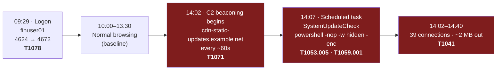
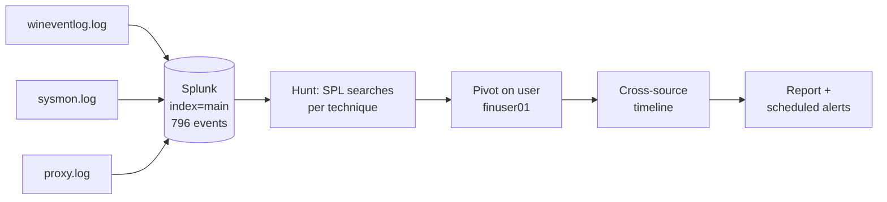
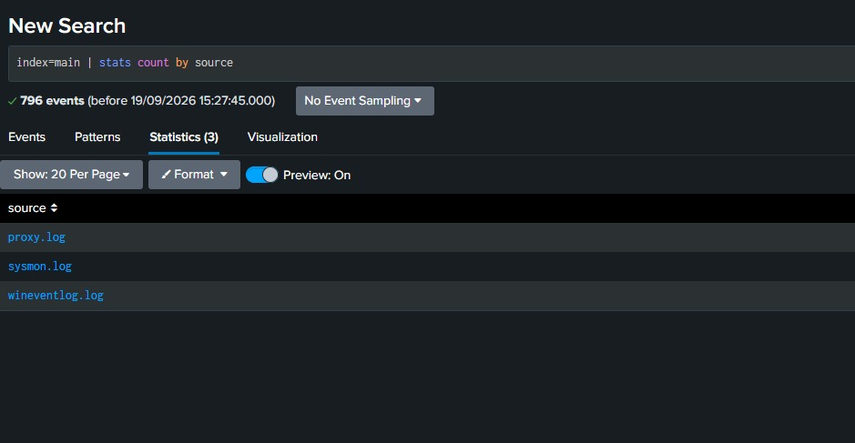
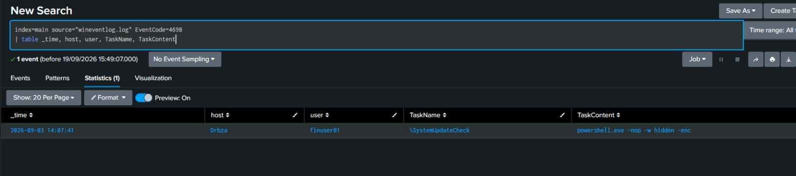
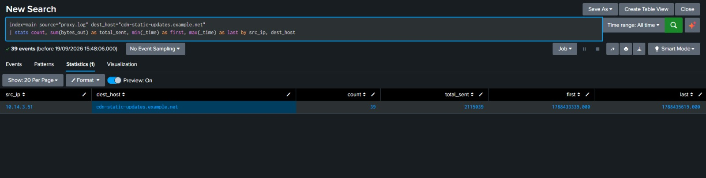
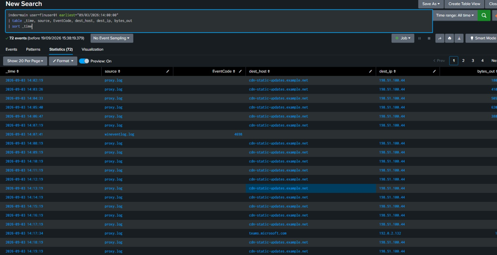

# splunk-attack-detection-lab

**Detecting a Windows intrusion in Splunk** — a SIEM investigation that correlates
Windows Event Logs, Sysmon and web-proxy data to reconstruct a full attack chain,
with detection searches written in SPL and mapped to MITRE ATT&CK.

---

## Overview

When three separate log sources land in a SIEM — Windows security events, Sysmon
endpoint telemetry and web-proxy traffic — no single one of them shows an attack.
The value is in correlating them. This project takes a synthetic incident data set,
loads it into Splunk, and works through it the way a SOC analyst would: follow the
weak signal, pivot across sources, and reconstruct what actually happened.

The investigation uncovered a compromised host beaconing to an external
command-and-control server on a fixed 60-second interval, with a scheduled task
established for persistence that runs hidden, encoded PowerShell — all traced to a
single user account across all three log sources.

## Attack chain reconstructed

## Investigation workflow

## What this demonstrates

- Operating Splunk: ingesting multiple sources, searching, and reporting.
- Writing SPL detection searches, from simple filters to statistical aggregation.
- Reading Windows Event IDs and Sysmon data forensically.
- Correlating evidence across independent log sources into one timeline.
- Mapping findings to MITRE ATT&CK.
- Writing an investigation up in clear, analyst-grade English.

## Data source

The log data used in this investigation comes from a SOC training lab exercise
and is not redistributed here for licensing reasons. It consists of three log
files — `wineventlog.log`, `sysmon.log` and `proxy.log`. All identifiers are
synthetic and all external IP addresses fall within the RFC 5737 documentation
ranges (`192.0.2.0/24`, `198.51.100.0/24`); no real system was accessed and no
personal data is present. The screenshots in this repository show the actual
analysis performed on that data.

## Setup (reproduce it yourself)

1. Install Splunk Enterprise (free trial) and open `http://localhost:8000`.
2. For each of the three log files: **Settings → Add Data → Upload**, set the index
   to `main`, and submit.
3. Set the search time range to **All time** (the data is dated and a narrow range
   returns nothing).
4. Run the searches in [`rules.md`](rules.md).
5. *(Optional)* Install the detections as scheduled alerts — see
   [Production alerts](#production-alerts) below.

## Detections

| # | Detection | MITRE ATT&CK | Result on this data |
|---|---|---|---|
| 1 | Failed-logon analysis (brute-force check) | T1110 | No brute force — 5 isolated failures (documented negative) |
| 2 | Scheduled-task persistence | T1053.005 | 1 malicious task: `SystemUpdateCheck` |
| 3 | Encoded / hidden PowerShell | T1059.001 | `powershell.exe -nop -w hidden -enc` |
| 4 | Successful logon + privilege assignment | T1078 | Account logon at 09:29, privileges at 09:29:01 |
| 5 | Cross-source user activity timeline | — | Full timeline for `finuser01` |
| 6 | C2 beaconing (fixed-interval outbound) | T1071 / T1041 | 39 connections, ~60s apart, ~2 MB sent |

Full searches, each explained line by line, are in [`rules.md`](rules.md).

## Production alerts

[`detections/savedsearches.conf`](detections/savedsearches.conf) packages the
detections as **scheduled Splunk alerts** with schedules, severities and alert
suppression (throttling) to prevent alert floods. Copy it to
`$SPLUNK_HOME/etc/apps/search/local/` and restart Splunk.

| Alert | Schedule | Severity | Logic |
|---|---|---|---|
| T1053.005 Scheduled task + hidden/encoded PowerShell | every 15 min | critical | 4698 where the task action contains `-enc`, `-w hidden` or `-nop` |
| T1071 C2 beaconing | hourly | critical | **Generalised** — any src/dest pair with ≥20 connections and interval jitter < 10 s; no hard-coded domain |
| T1078 Logon → special privileges | every 30 min | medium | `transaction` of 4624 followed by 4672 within 5 s |
| T1110 Brute force | every 15 min | high | ≥10 failed logons from one source in a 15-min bucket |

The beaconing alert is the important upgrade: the investigation search filters on the
already-known C2 domain, while the alert detects the **behaviour** (regular timing via
`streamstats` deltas and standard deviation) and would catch a new C2 domain too.

## Key finding

A single host (`10.14.3.51`, user `finuser01`) made **39 outbound connections** to
`cdn-static-updates.example.net` (`198.51.100.44`) over 38 minutes — an almost
exactly 60-second interval that is characteristic of automated C2 beaconing, not
human browsing. The beaconing began at 14:02; a scheduled task running hidden,
encoded PowerShell was created at 14:07, in the middle of the beacon window, tying
the command-and-control channel to the persistence mechanism. Roughly 2 MB was sent
to the external host, consistent with data exfiltration.

Full write-up: [`report.md`](report.md).

## Evidence screenshots

**Data sources ingested** — 796 events across three sources:

**Scheduled-task persistence (Event ID 4698)** — `SystemUpdateCheck` running
`powershell.exe -nop -w hidden -enc`:

**C2 beaconing** — 39 connections from `10.14.3.51`, 2,115,039 bytes sent:

**Cross-source timeline for `finuser01`** — proxy beacons with the 4698 task creation
landing inside the beacon window at 14:07:41:

## Limitations

- Synthetic lab data, not a live environment.
- Detection is only as good as the event types present in the logs.
- Thresholds and intervals are tuned to this data set and would need baselining in
  a real environment.
- This is a learning project, not a production detection package.

## Future work

- Add Sysmon process-tree analysis (Event ID 1) to identify the process behind the
  beaconing.
- [x] Convert the searches into saved Splunk alerts (`detections/savedsearches.conf`).
- Add a clean-baseline data set to measure the false-positive rate.
- Rebuild the same detections as a repeatable dashboard app.

## Ethical note

All data is synthetic sample data provided for training. No real system was attacked
and no real or personal data is involved.

## Author

**Basem Zaher Al-Ammari** — B.Sc. Cyber Security (Digital Forensics),
King Khalid University.
Companion project to [linux-intrusion-triage](https://github.com/Drcys/linux-intrusion-triage).

## License

MIT — see [LICENSE](LICENSE).
